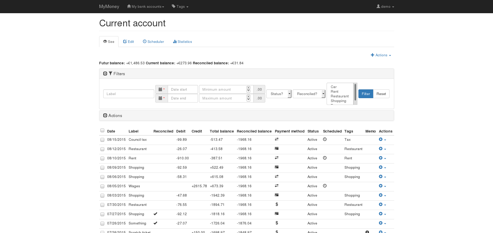
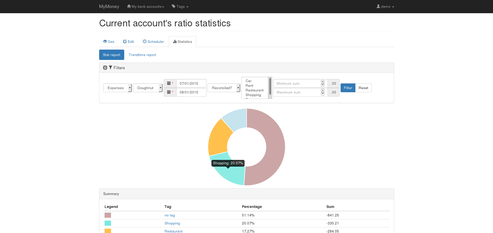

MyMoney's user guide
====================

.. image:: images/statistics-trendtime.png
   :alt: Trendtime report
   :width: 30 %

This is the documentation of the MyMoney project, a personal finance Web
application build with the `Django`_ framework.

Of course, just like this project, this documentation isn't really useful.
This is mainly a good use case to learn Sphinx and ReadTheDoc :)

.. _`Django`: https://www.djangoproject.com/

Contents
--------

.. toctree::
   :maxdepth: 3

   installation
   users
   bankaccounts
   tags
   schedulers
   banktransactions
   statistics
   admin
